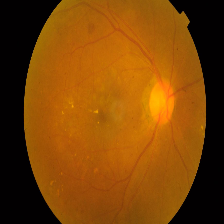

# Diabetic Retinopathy Grading

## Problem

<!--  -->

  

Diabetic Retinopathy is a complication of diabeties that effect eye. DR is the major cause of blindness in India, which accounts for 30% of DR cases in the world. Early diagnosis of DR can reduce the risk of blindness by 90%. Causes for DR can be identified using the following features:
1. Hemmorages
2. Abnormal growth of blood vessels
3. Exudates

Now lets see how DR can be classified into different types. The following table shows the classification of DR.

|Class|No DR|Mild DR|Moderate DR|Severe DR|Proliferate DR|
|:-----:|:---:|:-----:|:---------:|:-------:|:------------:| 
|**Image**||||||
|**Description**|cotton wool spots, venous beading, and severe intraretinal microvascular abnormalities (IRMA)| At least one microaneurysm present on retinal exam|Characterized by multiple microaneurysms, dot-and-blot hemorrhages, venous beading, and/or cotton wool spots|cotton wool spots, venous beading, and severe intraretinal microvascular abnormalities (IRMA)|cotton wool spots, venous beading, and severe intraretinal microvascular abnormalities (IRMA)

## Objective

## Methods

