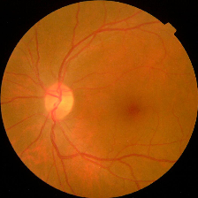

# Diabetic Retinopathy Grading

    The project report can be found here : 

    The project presention can be found here :

## Problem

<!--  -->

  

Diabetic Retinopathy is a complication of diabeties that effect eye. DR is the major cause of blindness in India, which accounts for 30% of DR cases in the world. Early diagnosis of DR can reduce the risk of blindness by 90%. Causes for DR can be identified using the following features:
1. Hemmorages
2. Abnormal growth of blood vessels
3. Exudates

Now lets see how DR can be classified into different types. The following table shows the classification of DR.

|Class|No DR|Mild DR|Moderate DR|Severe DR|Proliferate DR|
|:-----:|:---:|:-----:|:---------:|:-------:|:------------:| 
**Image**||||||
**Description**|No presence of DR features. Clean Eye| At least one microaneurysm present on retinal exam|Multiple microaneurysms, dot-and-blot hemorrhages, venous beading, and/or cotton wool spots|Cotton wool spots, venous beading, and severe intraretinal microvascular abnormalities (IRMA)|Growth of new blood vessels, Blood vessels bleeding, Retinal detachment

## Objective

The objective our work is to classify the DR into different types. This is called as DR grading. The grading labels are as follows:

    0. No DR 
    1. Mild DR
    2. Moderate DR
    3. Severe DR
    4. Proliferate DR
   
We would like to classify the input image into one of those five classes.

## Methods

### Binary Classification

First we will consider a simpler task of binary classification of DR. Its basically saying *DR* or *No DR*. To achieve this, the four DR classes are merged into meta class *DR*. Now its a binary classification problem. Deep neural netoworks can be used to classify the image into one of the two classes. Four standard deep neural network architectures are used to classify the image. The performance results are shown below table.

|Network | Top 1 Accuracy | Precision | Recall | F1 Score |False classifications(out of 800)|
|:-----:|:--------------:|:---------:|:-------:|:--------:|:--------------------:|
|VGG19|0.977|0.98|0.98|0.98|18|
|ResNet18|0.974|0.97|0.97|0.97|21|
|EfficientNetB0|0.974|0.97|0.97|0.97|21|
|ConvNext-Tiny|**0.981**|0.98|0.98|0.98|**13**|

ConvNext-Tiny is the best performing model. It has a top 1 accuracy of 0.981 and a precision of 0.98, recall of 0.98 and F1 score of 0.98. It has a false classifications of 13.

### Multi Class Classification

|Network | Top 1 Accuracy | Precision | Recall | F1 Score |False classifications(out of 800)|
|:-----:|:--------------:|:---------:|:-------:|:--------:|:--------------------:|
|VGG19|0.9644|0.96|0.96|0.96|25|
|ResNet18|0.99|0.98|0.98|0.98|7|
|EfficientNetB0|**0.997**|0.99|0.99|0.99|**2**|
|ConvNext-Tiny|0.995|0.99|0.99|0.99|3|

EfficientNetB0 is the best performing model. It has a top 1 accuracy of 0.997 and a precision of 0.99, recall of 0.99 and F1 score of 0.99. It has a false classifications of 2.

